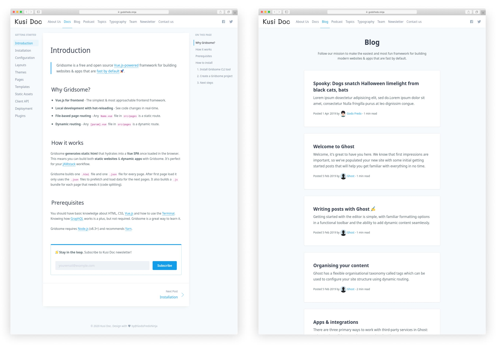

# Kusi Doc free theme for [Ghost](https://github.com/tryghost/ghost/)

[](https://github.com/TryGhost/Ghost)
[](https://www.paypal.me/godofredoninja)
[](https://www.buymeacoffee.com/GodoFredoNinja)

> *Kusi Doc is a beautiful and elegant theme for the documentation of your project.*

Hello :smile: , I created this theme for the documentation of your project.
It is available for free so you can use on your site. If you have any suggestions to improve the theme send me a tweet [@GodoFredoNinja](https://goo.gl/y3aivK)

## If you have a :heart: and value my work. :pray: Please, help me with a small donation on [Paypal](https://www.paypal.me/godofredoninja) or [Here](https://www.paypal.com/cgi-bin/webscr?cmd=_s-xclick&hosted_button_id=Y7UB5Q8GVN3HN&source=url). It'll help motivate me to update the theme with many improvements

[](https://www.paypal.me/godofredoninja)

:arrow_right: If you still don't have a **Hosting for your Ghost**. Use [Digital Ocean](https://m.do.co/c/710a27a3b3de) using my [referral link]((https://m.do.co/c/710a27a3b3de)) and you will get free a **$50 credit** to use in [Digital Ocean]((https://m.do.co/c/710a27a3b3de)). This way you will also be helping me.

[](https://godofredo.ninja)

[](https://raw.githubusercontent.com/godofredoninja/kusi-doc/master/documentation/doc-blog.jpg)

## Featured

- Support for different [languages](http://themes.ghost.org/docs/i18n#section-how-to-add-any-language) (en - es)
- Previous and next Post
- YouTube, Vimeo, kickstarter, dailymotion => Responsive
- Code syntax [Prismjs](http://prismjs.com/index.html#languages-list) Supported all syntax

## Table of Contents

- [Web Browser Support for Kusi Doc](#web-browser-support-for-kusi-doc)
- [Ghost Settings](#ghost-settings)
- [Home Page](#home-page)
- [Documentation Page](#documentation-page)
- [Blog Page](#blog-page)
- [Theme Translation](#theme-translation)
- [PrismJS code syntax](#prismjs-code-syntax)

## Web Browser Support for Kusi Doc

Kusi Doc supports the following web [browsers](http://caniuse.com/#search=flexbox).

## Ghost Settings

Enable the following checkbox on the Labs page in the Ghost admin panel.


## Home Page

- Create a new page
- Choose your favorite title
- Use the url `kusi-doc-home` or your favorite url
- First back up your routes in your ghost settings `Labs -> Routes -> Download current routes.yml`
- Re-download the Route and edit `routes.yml` line `routes`

```yaml
routes:
  # Home Page - kusi Doc
  /:
    data:
      post: page.kusi-doc-home
    template: kusi-doc-home
```

- In an `HTML` block in your ghost editor add this code for your content.

```html
  <!-- Description -->
  <p class="mt-6 text-lg text-center leading-normal lg:max-w-xl">Beautiful and elegant theme for the documentation of your project.</p>
  <!-- Verion -->
  <p class="flex justify-center mt-6 text-sm text-gray-500">v1.0</p>
```

- Buttons

```html
  <div class="md:flex mt-16">
    <!-- Documentation -->
    <a href="http://localhost:2368/kusi-docs/" class="flex items-center mt-2 mx-2 px-4 py-2 rounded-lg border text-gray-700 hover:bg-gray-200 hover:border-gray-500">
      <svg class="fill-current mr-2 w-4 h-4"><use xlink:href="#icon-doc"></use></svg>
      Documentation
    </a>

    <!-- Github -->
    <a href="https://github.com/godofredoninja/kusi-doc" class="flex items-center mt-2 mx-2 px-4 py-2 rounded-lg border text-gray-700 hover:bg-gray-200 hover:border-gray-500">
      <svg class="fill-current mr-2 w-4 h-4"><use xlink:href="#icon-github"></use></svg>
      Source on Github
    </a>

    <!-- Blog -->
    <a href="http://localhost:2368/kusi-blog/" class="flex items-center mt-2 mx-2 px-4 py-2 rounded-lg border text-gray-700 hover:bg-gray-200 hover:border-gray-500">
      <svg class="fill-current mr-2 w-4 h-4"><use xlink:href="#icon-rss"></use></svg>
      Blog
    </a>
  </div>
```

## Documentation Page

To create the documentation page is very easy, you have to create an article and choose in template `kusi-doc`. you also have to add the primary tag `docs`.

:nerd_face: The secondary menu will be used on the documentation page.

So we need to make some changes to our routes.

:arrow_right: **Doc Collection**

- Appears on: `site.com/docs/`
- Post URLs: `site.com/docs/my-documentation/`
- Contains posts with: a `primary_tag` of `docs`

```yaml
collections:
  /docs/:
    permalink: /docs/{slug}/
    filter: primary_tag:docs
```

## Blog Page

To have a blog page is very easy. Just add a primary tag called `blog` in your articles

So we need to make some changes to our routes.

:arrow_right: **Blog collection**

- Appears on: `site.com/blog/`
- Post URLs: `site.com/blog/my-story/`
- Contains posts with: a `primary_tag` of `blog`

```yaml
collections:
  /blog/:
    permalink: /blog/{slug}/
    template: kusi-doc-blog
    filter: primary_tag:blog
```

:sweat_smile: If you want to pass content to the blog page as a title and a description.

- Create a new page
- Choose your favorite title
- Use the url `kusi-doc-blog` or your favorite url

```yaml
collections:
  /blog/:
    permalink: /blog/{slug}/
    template: kusi-doc-blog
    filter: primary_tag:blog
    data:
      post: page.kusi-doc-blog
```

## Theme Translation

**Kusi Doc supports:**

- `en` — English default language
- `es` — Español


if you want to have in another language you just have to copy `locales>en.json` and rename the file then translate to your favorite language:

Just enter the [language/locale tag](https://www.w3schools.com/tags/ref_language_codes.asp) of the files to use (e.g.: `fr.json` for French, `zh.json` for Chinese, `ja.json` for Japanese)

## PrismJS code syntax

Make your code stand out with the PrismJS code highlighter.
PrismJS allows you to select which languge you embeded and performs code highlighting according to the language. Neat!

Take a look at the [Prismjs Supported Language List](http://prismjs.com/#languages-list)

## Credits

- [Tailwindcss](https://github.com/tailwindcss/tailwindcss)
- [Tocbot](https://github.com/tscanlin/tocbot)
- [Medium Zoom](https://github.com/francoischalifour/medium-zoom)
- [Prismjs](http://prismjs.com/)
- [Safari Light - Mockup](https://www.uplabs.com/posts/safari-light-version)

## Copyright & License

Copyright (c) 2020 GodoFredo - Released under the [MIT license](LICENSE)